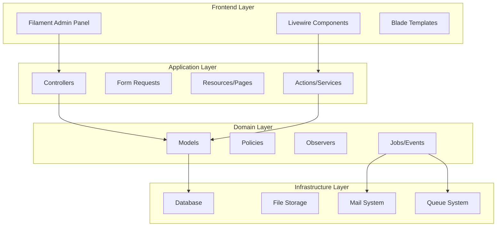
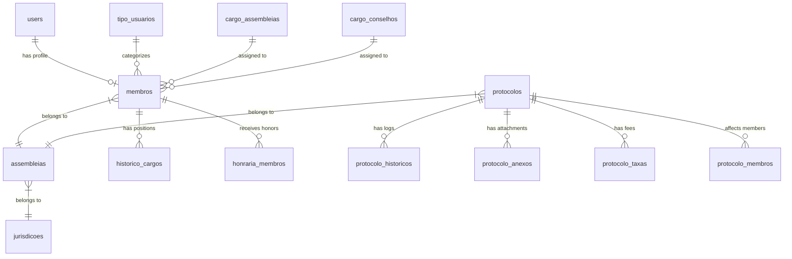

# Design Document

## Overview

Este documento apresenta o design técnico para implementar um sistema completo de protocolos e gestão de usuários em uma aplicação Laravel existente que utiliza Filament como interface administrativa. O sistema gerenciará diferentes tipos de usuários organizacionais, níveis de acesso hierárquicos, cargos administrativos e diversos fluxos de protocolos para cerimônias e honrarias.

O design aproveita a estrutura existente do Laravel com Spatie Permissions, Filament Admin Panel, e modelos já estabelecidos (User, Membro, Assembleia, Protocolo), expandindo-os para atender aos novos requisitos.

## Architecture

### System Architecture



### Database Architecture



## Components and Interfaces

### 1. User Type Management System

#### Enhanced User Model
```php
// Extending existing User model
class User extends Authenticatable implements FilamentUser
{
    // New fields for user type management
    protected $fillable = [
        // ... existing fields
        'tipo_usuario', // enum: menina_ativa, maioridade, tio_macom, tia_estrela, tio, tia
        'nivel_acesso', // enum: admin_assembleia, membro_jurisdicao, membro
    ];
}
```

#### New TipoUsuario Model
```php
class TipoUsuario extends Model
{
    protected $fillable = [
        'codigo',
        'nome',
        'descricao',
        'requer_assembleia',
        'requer_pais_responsaveis',
        'campos_especificos', // JSON for type-specific fields
    ];
}
```

#### Enhanced Membro Model
```php
class Membro extends Model
{
    protected $fillable = [
        // ... existing fields
        'tipo_usuario_id',
        'loja_maconica', // for Tio Maçom
        'capitulo_estrela', // for Tia Estrela do Oriente
        'grau_maconico', // enum: aprendiz, companheiro, mestre
        'data_companheiro',
        'data_mestre',
        'data_iniciacao_arco_iris', // for Tia Estrela (optional)
    ];
}
```

### 2. Access Control System

#### Role and Permission Structure
```php
// Roles hierarchy
'super_admin' => 'Administrador Sistema',
'membro_jurisdicao' => 'Membro da Jurisdição',
'admin_assembleia' => 'Admin Assembleia',
'presidente_honrarias' => 'Presidente Comissão Honrarias',
'membro' => 'Membro'

// Permissions by module
'protocolos.create' => 'Criar Protocolos',
'protocolos.approve' => 'Aprovar Protocolos',
'protocolos.manage_taxes' => 'Gerenciar Taxas',
'cargos.assign' => 'Atribuir Cargos',
'membros.manage' => 'Gerenciar Membros'
```

#### Policy Classes
```php
class ProtocoloPolicy
{
    public function create(User $user): bool
    {
        return $user->hasRole(['admin_assembleia', 'membro_jurisdicao']);
    }
    
    public function approve(User $user, Protocolo $protocolo): bool
    {
        return $user->hasRole('membro_jurisdicao') || 
               ($user->hasRole('presidente_honrarias') && 
                in_array($protocolo->tipo, ['homenageados_ano', 'coracao_cores', 'grande_cruz_cores']));
    }
}
```

### 3. Position Management System

#### CargoAssembleia Model (Enhanced)
```php
class CargoAssembleia extends Model
{
    protected $fillable = [
        'assembleia_id',
        'membro_id',
        'tipo_cargo_id',
        'data_inicio',
        'data_fim',
        'ativo',
        'atribuido_por',
        'protocolo_id', // reference to assignment protocol
    ];
}
```

#### New CargoConselho Model
```php
class CargoConselho extends Model
{
    protected $fillable = [
        'assembleia_id',
        'membro_id',
        'tipo_cargo',
        'data_inicio',
        'data_fim',
        'ativo',
        'concede_admin_acesso', // for executive positions
        'protocolo_id',
    ];
}
```

### 4. Protocol System Architecture

#### Enhanced Protocolo Model
```php
class Protocolo extends Model
{
    protected $fillable = [
        // ... existing fields
        'tipo_protocolo', // enum: maioridade, iniciacao, homenageados_ano, etc.
        'etapa_atual', // current workflow step
        'data_cerimonia',
        'valor_taxa',
        'comprovante_pagamento',
        'feedback_rejeicao',
        'aprovado_por',
        'data_aprovacao',
    ];
    
    protected $casts = [
        'dados_membros' => 'array', // members affected by protocol
        'configuracao_etapas' => 'array', // workflow configuration
    ];
}
```

#### Protocol Workflow Engine
```php
class ProtocoloWorkflow
{
    protected array $workflows = [
        'maioridade' => [
            'criacao' => AdminAssembleiaAction::class,
            'aprovacao' => MembroJurisdicaoAction::class,
        ],
        'homenageados_ano' => [
            'criacao' => AdminAssembleiaAction::class,
            'aprovacao_honrarias' => PresidenteHonrariasAction::class,
            'definir_taxas' => MembroJurisdicaoAction::class,
            'pagamento' => AdminAssembleiaAction::class,
            'aprovacao_final' => MembroJurisdicaoAction::class,
        ],
    ];
}
```

### 5. Filament Resources and Pages

#### Protocol Management Resources
```php
class ProtocoloResource extends Resource
{
    public static function form(Form $form): Form
    {
        return $form->schema([
            Select::make('tipo_protocolo')
                ->options(TipoProtocolo::pluck('nome', 'codigo'))
                ->reactive()
                ->afterStateUpdated(fn ($state, callable $set) => 
                    $set('schema_campos', TipoProtocolo::find($state)?->schema_campos)
                ),
            
            // Dynamic form fields based on protocol type
            Group::make()
                ->schema(fn (Get $get) => $this->getDynamicFields($get('tipo_protocolo')))
                ->visible(fn (Get $get) => filled($get('tipo_protocolo'))),
        ]);
    }
}
```

#### Member Selection Components
```php
class MembroSelectionComponent extends Component
{
    public string $protocolType;
    public array $selectedMembers = [];
    
    public function getEligibleMembers()
    {
        return match($this->protocolType) {
            'maioridade' => Membro::ativas()->get(),
            'coracao_cores' => Membro::whereDoesntHave('honrarias', 
                fn($q) => $q->where('tipo', 'coracao_cores'))->get(),
            'conselho_presidente' => Membro::tiosMacons()
                ->where('grau_maconico', 'mestre')->get(),
        };
    }
}
```

## Data Models

### Core Entity Relationships

#### User Type System
```sql
-- Enhanced users table
ALTER TABLE users ADD COLUMN tipo_usuario_id BIGINT UNSIGNED;
ALTER TABLE users ADD COLUMN nivel_acesso ENUM('admin_assembleia', 'membro_jurisdicao', 'membro');

-- New tipo_usuarios table
CREATE TABLE tipo_usuarios (
    id BIGINT UNSIGNED PRIMARY KEY,
    codigo VARCHAR(50) UNIQUE,
    nome VARCHAR(100),
    descricao TEXT,
    requer_assembleia BOOLEAN DEFAULT TRUE,
    requer_pais_responsaveis BOOLEAN DEFAULT TRUE,
    campos_especificos JSON,
    created_at TIMESTAMP,
    updated_at TIMESTAMP
);
```

#### Enhanced Member System
```sql
-- Enhanced membros table
ALTER TABLE membros ADD COLUMN tipo_usuario_id BIGINT UNSIGNED;
ALTER TABLE membros ADD COLUMN loja_maconica VARCHAR(200);
ALTER TABLE membros ADD COLUMN capitulo_estrela VARCHAR(200);
ALTER TABLE membros ADD COLUMN grau_maconico ENUM('aprendiz', 'companheiro', 'mestre');
ALTER TABLE membros ADD COLUMN data_companheiro DATE;
ALTER TABLE membros ADD COLUMN data_mestre DATE;
ALTER TABLE membros ADD COLUMN data_iniciacao_arco_iris DATE;
```

#### Position Management
```sql
-- New cargo_conselhos table
CREATE TABLE cargo_conselhos (
    id BIGINT UNSIGNED PRIMARY KEY,
    assembleia_id BIGINT UNSIGNED,
    membro_id BIGINT UNSIGNED,
    tipo_cargo ENUM('presidente', 'preceptora_mae', 'preceptora_mae_adjunta', 'membro_conselho'),
    data_inicio DATE,
    data_fim DATE,
    ativo BOOLEAN DEFAULT TRUE,
    concede_admin_acesso BOOLEAN DEFAULT FALSE,
    protocolo_id BIGINT UNSIGNED,
    created_at TIMESTAMP,
    updated_at TIMESTAMP
);
```

#### Protocol System
```sql
-- Enhanced protocolos table
ALTER TABLE protocolos ADD COLUMN tipo_protocolo VARCHAR(50);
ALTER TABLE protocolos ADD COLUMN etapa_atual VARCHAR(50);
ALTER TABLE protocolos ADD COLUMN data_cerimonia DATE;
ALTER TABLE protocolos ADD COLUMN valor_taxa DECIMAL(10,2);
ALTER TABLE protocolos ADD COLUMN comprovante_pagamento VARCHAR(500);
ALTER TABLE protocolos ADD COLUMN feedback_rejeicao TEXT;
ALTER TABLE protocolos ADD COLUMN aprovado_por BIGINT UNSIGNED;
ALTER TABLE protocolos ADD COLUMN data_aprovacao TIMESTAMP;
ALTER TABLE protocolos ADD COLUMN dados_membros JSON;
ALTER TABLE protocolos ADD COLUMN configuracao_etapas JSON;

-- New protocolo_membros pivot table
CREATE TABLE protocolo_membros (
    id BIGINT UNSIGNED PRIMARY KEY,
    protocolo_id BIGINT UNSIGNED,
    membro_id BIGINT UNSIGNED,
    presente_cerimonia BOOLEAN DEFAULT NULL,
    observacoes TEXT,
    created_at TIMESTAMP,
    updated_at TIMESTAMP
);
```

## Error Handling

### Validation Rules

#### Protocol Creation Validation
```php
class CreateProtocoloRequest extends FormRequest
{
    public function rules(): array
    {
        return [
            'tipo_protocolo' => 'required|exists:tipo_protocolos,codigo',
            'assembleia_id' => 'required|exists:assembleias,id',
            'membros_selecionados' => 'required|array|min:1',
            'membros_selecionados.*' => 'exists:membros,id',
            'data_cerimonia' => 'nullable|date|after:today',
        ];
    }
    
    public function withValidator($validator): void
    {
        $validator->after(function ($validator) {
            $this->validateMemberEligibility($validator);
            $this->validateUserPermissions($validator);
        });
    }
}
```

#### Business Logic Validation
```php
class ProtocoloValidator
{
    public function validateMemberEligibility(array $memberIds, string $protocolType): array
    {
        return match($protocolType) {
            'coracao_cores' => $this->validateUniqueHonor($memberIds, 'coracao_cores'),
            'grande_cruz_cores' => $this->validateUniqueHonor($memberIds, 'grande_cruz_cores'),
            'conselho_presidente' => $this->validateMasterMason($memberIds),
            default => []
        };
    }
}
```

### Exception Handling
```php
class ProtocoloException extends Exception
{
    public static function memberNotEligible(string $memberName, string $reason): self
    {
        return new self("Membro {$memberName} não é elegível: {$reason}");
    }
    
    public static function workflowViolation(string $currentStep, string $attemptedStep): self
    {
        return new self("Não é possível avançar de {$currentStep} para {$attemptedStep}");
    }
}
```

## Testing Strategy

### Unit Testing Approach

#### Model Testing
```php
class MembroTest extends TestCase
{
    /** @test */
    public function it_can_determine_member_eligibility_for_honors()
    {
        $membro = Membro::factory()->create();
        
        $this->assertTrue($membro->isEligibleFor('coracao_cores'));
        
        $membro->honrarias()->create(['tipo' => 'coracao_cores']);
        
        $this->assertFalse($membro->isEligibleFor('coracao_cores'));
    }
}
```

#### Protocol Workflow Testing
```php
class ProtocoloWorkflowTest extends TestCase
{
    /** @test */
    public function it_follows_correct_workflow_for_honors_protocol()
    {
        $protocolo = Protocolo::factory()->create(['tipo_protocolo' => 'homenageados_ano']);
        
        $workflow = new ProtocoloWorkflow($protocolo);
        
        $this->assertEquals('aguardando_aprovacao_honrarias', $workflow->nextStep());
        
        $workflow->approve('presidente_honrarias');
        
        $this->assertEquals('definir_taxas', $workflow->nextStep());
    }
}
```

### Integration Testing

#### Filament Resource Testing
```php
class ProtocoloResourceTest extends TestCase
{
    /** @test */
    public function admin_can_create_maioridade_protocol()
    {
        $admin = User::factory()->adminAssembleia()->create();
        $membros = Membro::factory()->count(3)->ativas()->create();
        
        $this->actingAs($admin)
            ->post(route('filament.admin.resources.protocolos.store'), [
                'tipo_protocolo' => 'maioridade',
                'membros_selecionados' => $membros->pluck('id')->toArray(),
            ])
            ->assertRedirect();
            
        $this->assertDatabaseHas('protocolos', [
            'tipo_protocolo' => 'maioridade',
            'status' => 'aguardando_aprovacao',
        ]);
    }
}
```

### Feature Testing

#### End-to-End Protocol Flow
```php
class ProtocoloFlowTest extends TestCase
{
    /** @test */
    public function complete_honors_protocol_workflow()
    {
        // 1. Admin creates protocol
        $admin = User::factory()->adminAssembleia()->create();
        $protocolo = $this->createHonorsProtocol($admin);
        
        // 2. President approves
        $presidente = User::factory()->presidenteHonrarias()->create();
        $this->approveProtocol($presidente, $protocolo);
        
        // 3. Jurisdiction sets fees
        $jurisdicao = User::factory()->membroJurisdicao()->create();
        $this->setProtocolFees($jurisdicao, $protocolo, 150.00);
        
        // 4. Admin pays
        $this->payProtocolFees($admin, $protocolo);
        
        // 5. Final approval
        $this->finalApproval($jurisdicao, $protocolo);
        
        $this->assertEquals('concluido', $protocolo->fresh()->status);
    }
}
```

### Performance Testing

#### Database Query Optimization
```php
class ProtocoloPerformanceTest extends TestCase
{
    /** @test */
    public function protocol_listing_uses_efficient_queries()
    {
        Protocolo::factory()->count(100)->create();
        
        DB::enableQueryLog();
        
        $response = $this->get(route('filament.admin.resources.protocolos.index'));
        
        $queries = DB::getQueryLog();
        
        // Should not exceed N+1 query threshold
        $this->assertLessThan(10, count($queries));
    }
}
```

This design provides a comprehensive foundation for implementing the protocol and user management system while leveraging the existing Laravel/Filament infrastructure and maintaining scalability and maintainability.